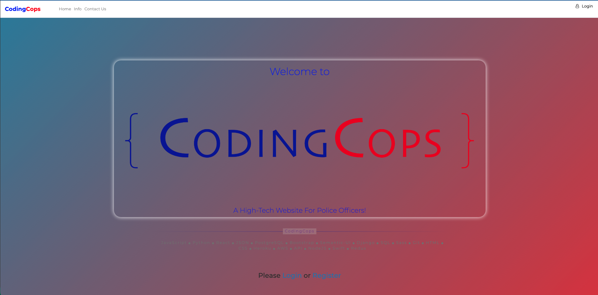
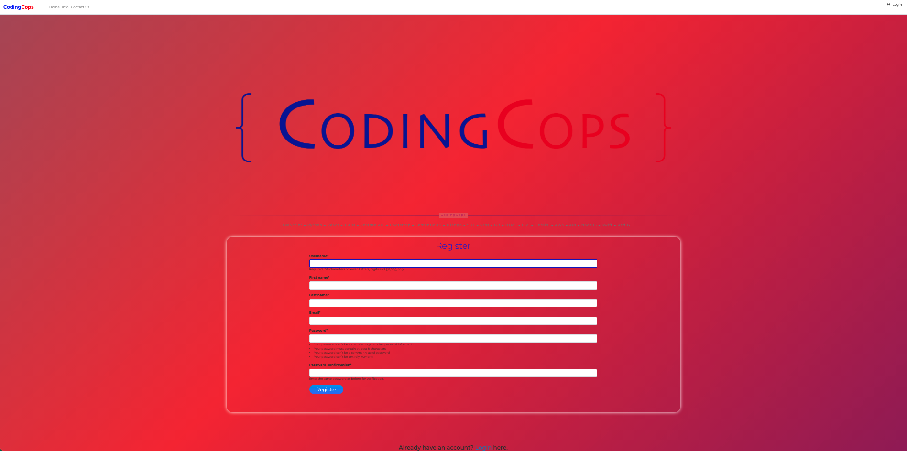
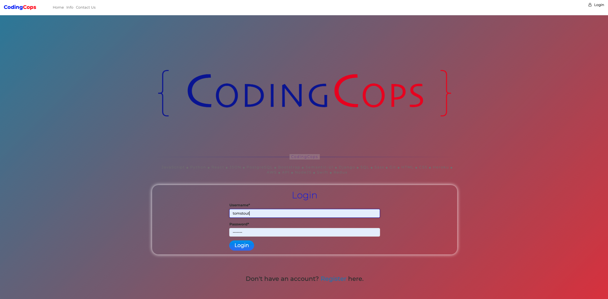
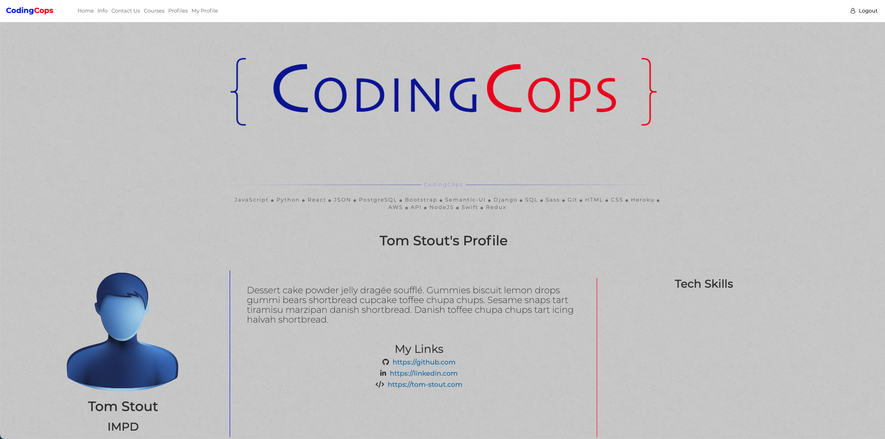
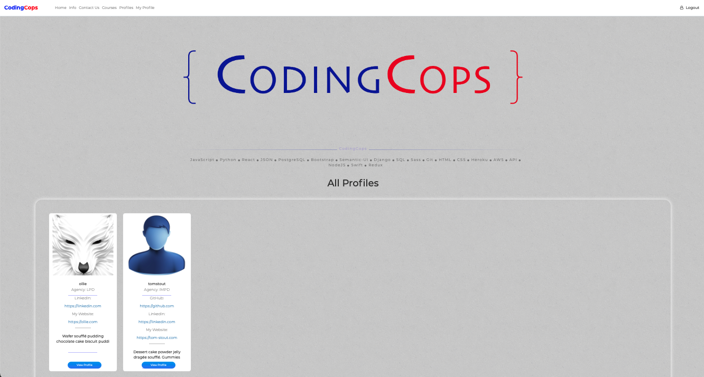
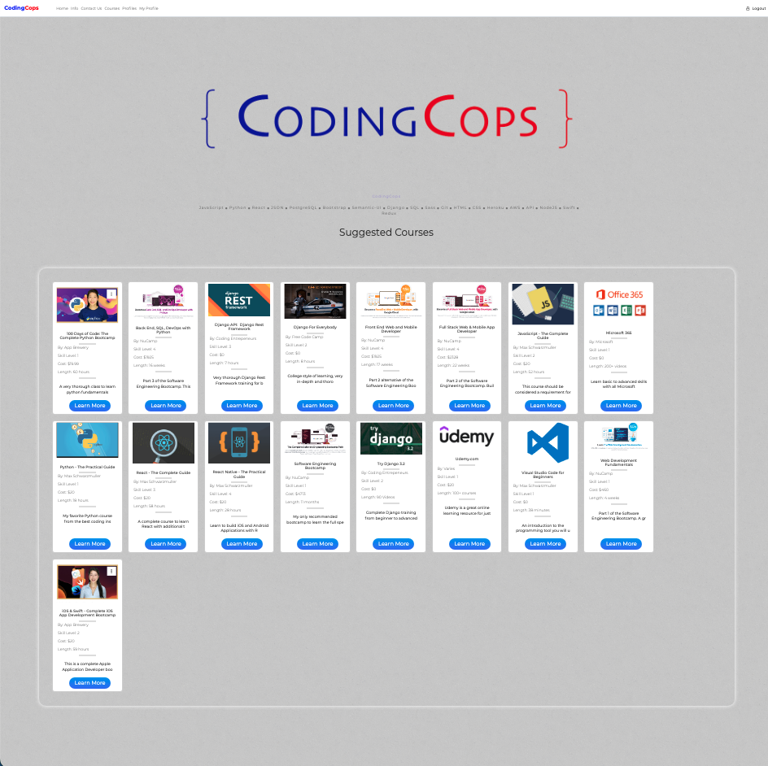
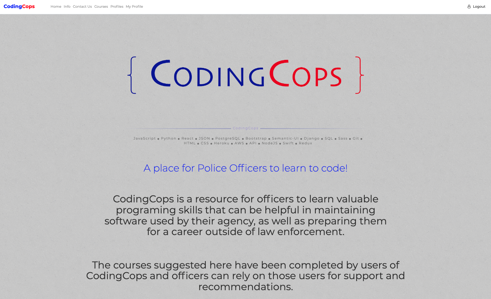
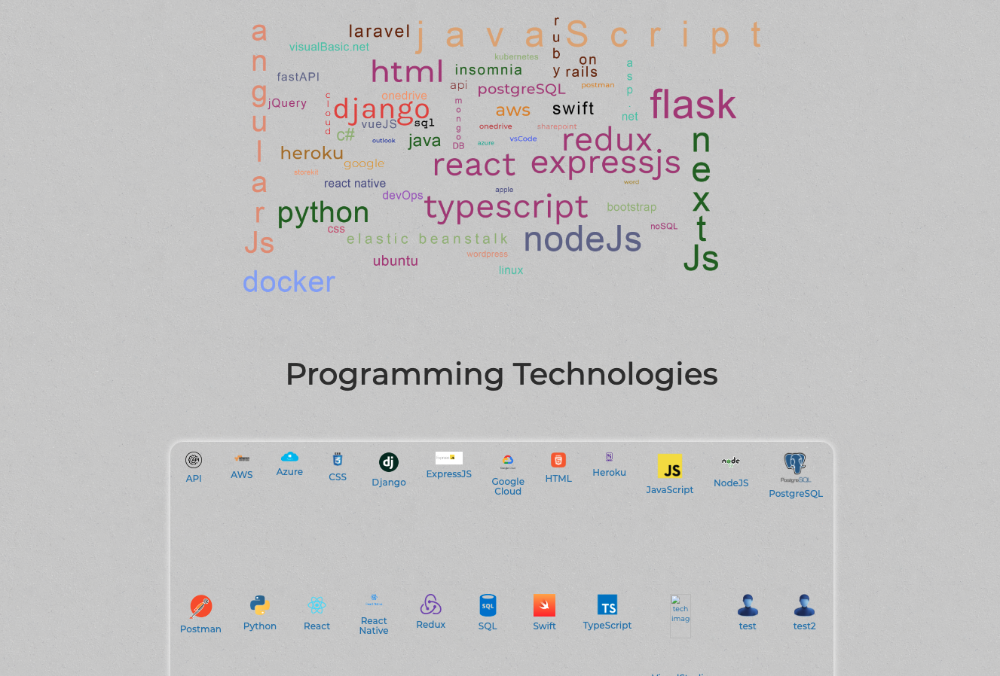
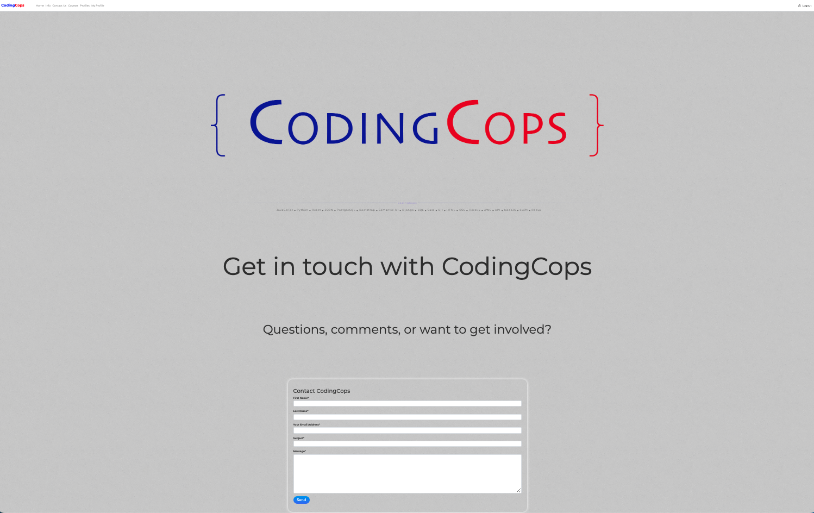

<h1 align="center">CodingCops</h1>

<h4 align="center">
CodingCops is a resource center for police officers who want to learn about technology and programing languages.  </h4>
This is currently a work-in-progress and will be updated when complete.</h4>
<h4 align="center">
This website will allow officers to log in and create their profile.  They can find information about technologies and courses, and communicate with others who are or have taken the course. 
</h4>

<h4 align="center">
This project takes advantage of Django's template inheritance by designing the navbar and hero image for each page in the index.html file, and utilizing them in each of the site's pages.</h4>
<h4 align="center">
Users will see a different style for logged in users and visitors not logged in.  I created a CSS for vistors with red and blue floating colors, then created a separate CSS for logged in users for an easier-to-read and less distracting style.</h4>

## Technology Stack:

> 

  

## My goal for this website is:
1. Create a website for officers to communicate with each other
2. Present information about specific technologies
3. Identify training resources available

___

## User Information
1. User agency
2. Goals
3. Skill level
4. Courses attending
5. Courses completed
            

##  Technology Information
1. Name and description
2. Training resources

##  Course Information
1. Courses available
2. Information:
    * Cost
    * Length
    * Instructor
    * Course feedback

## My database includes:
-   User tables for login and authentication
-   Technologies Table
-   Courses Table
-   Messaging Database  

## Relationships:
1. Courses - Users: Many To Many
2. Courses - Technologies: One to Many 
3. Users - Messages: Many to Many
4. Users - Technologies: Many to Many

## CRUD Operations:
- User Profiles 
- Courses
- Technologies

___

<!-- <h1 align="center">Links</h1>

* GitHub Local Version:  https://github.com/Tom-Stout325/flightplan-local.git

* GitHub AWS Version:  https://github.com/Tom-Stout325/flightplan-aws.git

* Docker Hub:  https://hub.docker.com/u/tomstout325  

___ -->

<!-- <h1 align="center">Instructions</h1> -->

<!-- 1. Create a PostgreSQL database:  
    - drones

2. A sample database is provided:
    - Flights-Drones.sql
    - Copy the SQL statments into PGAdmin and run

3. Create a virtual environment
    - python3 -m venv venv

4. Run virtual environment:
    - source venv/bin/activate

5. Install packages:    
    - pip install -r requirements.txt -->

<h1 align="center">Screenshots</h1>

> 

